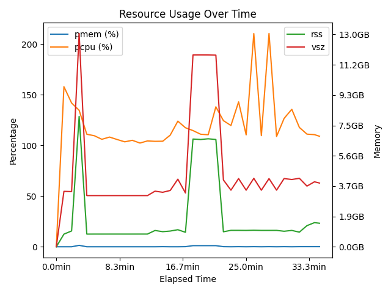

# Demos Repository

This repository contains various demonstration projects and examples.

## Demos

| Demo | Description | Preview | Resources |
|------|-------------|---------|-----------|
| [sfn-2025](./sfn-2025/) | Demonstrates how `duct` and `datalad` compose to provide structured, reproducible execution of neuroimaging workflows. Shows resource monitoring, provenance tracking, and real-world MRIQC dataset analysis. |  |  |

## Structure

Each demo is contained in its own directory with:
- A dedicated virtual environment (`venv/`)
- Demo-specific README with instructions
- Any necessary scripts and resources
